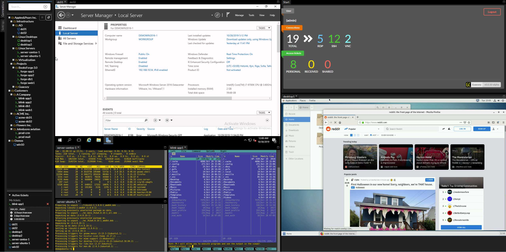

# guacozy
__Cozy server administration tool based on [Apache Guacamole™](https://guacamole.apache.org/)__

## Demo
[Video](https://youtu.be/Hx8Cqrug5mM)

Screenshot:


## Links
[guacozy-server on Dockerhub](https://hub.docker.com/r/guacozy/guacozy-server)


# How to run

To run you need a database url. 

To connect to remote servers (RDP/SSH/VNC) you need a **guacd** service.   
You can use your existing **guacd** (if you used guacamole before) or use one in container  
e.g. 

## docker cmd example
```
docker run -it --rm -p 8080:80 -p 8443:443 guacozy/guacozy-server
```
This will start a container with **sqlite** database (destroyed after container is down)  
In order to actually use it, it should be able to connect to **guacd** service  
You can run **guacd** as container:
```
docker run --name guacdlocal --restart always -d -p 4822:4822 linuxserver/guacd
```
This will start guacd container with restart policy **always**, name **guacdlocal** 
and published port **4822** in **detached** (-d) mode

Make sure to add a guacd server in AppSettings (or change the default guacdserver) to include this  
Hostname: $IP, Port: 4822

Where $IP is address of your docker machine (127.0.0.1 will not do, as container will try to connect to itself)

You can find other builds of guacd containers here: 
[1](https://hub.docker.com/r/glyptodon/guacd) 
[2](https://hub.docker.com/r/guacamole/guacd) 
[3](https://hub.docker.com/r/linuxserver/guacd)  

## docker-compose example
This example of a composite with 3 services:  
* guacozy-server
* guacd
* postgresql

```
# docker-compose.yml

version: '3'  
services:
  server:
    image: guacozy/guacozy-server
    restart: always
    depends_on:
      - db
    volumes:
      - staticfiles:/app/staticfiles/
    environment:
      - DJANGO_SECRET_KEY=abcdefghijklmnopqrstuvwxyzabcdefghijklmnopqrstuvwxyz
      - FIELD_ENCRYPTION_KEY=qjq4ObsXMqiqQyfKgD-jjEGm4ep8RaHKGRg4ohGCi1A=
      - DJANGO_DB_URL=postgres://postgres@db:5432/postgres
    ports:
      - 8080:80
      - 8443:443
  guacd:
    image: linuxserver/guacd
    restart: always
  db:
    image: postgres:10.4-alpine
    restart: always
    volumes:
    - postgres-data:/var/lib/postgresql/data
volumes:
  staticfiles:
  postgres-data:
```

### Environment variables:  
`DEBUG` : Django DEBUG mode  

`DJANGO_SECRET_KEY` : random string used for hashing (50 chars)  

`FIELD_ENCRYPTION_KEY` - encryption key which will be used to encrypt passwords in database  
> If you don't specify FIELD_ENCRYPTION_KEY, default will be used (bad idea).   
> If you use with one key and later change - your stored passwords will not work
>
> After you start, generate one with  
>`./manage.py generate_encryption_key` 
> 
> In docker compose:   
> `docker-compose exec server ./manage.py generate_encryption_key` 
> 
> If key is not provided, on container start you will be notified and a new key will be generated  
> You can use it, as suggested value is unique on every container start

`DJANGO_TIME_ZONE` : timezone (e.g. Europe/Vilnius)

`DJANGO_DB_URL` : DB URL - read at [django-environ documentation](https://django-environ.readthedocs.io/en/latest/index.html)

`SUPERUSER_NAME`,`SUPERUSER_EMAIL`,`SUPERUSER_PASSWORD` : use these if you want default admin to have specified values  
> If you don't specify these values, user **admin** with password **admin** 
> and email **admin@example.com** wiil be created.  
> You can always change admin's email/password later, 
>however if you ever delete "admin" user it will be recreated on next startup.  
>So if you are unhappy with **admin** username, specify just it (you can specify name/email and skip password)

## Notes

### SSL
Container exposes ports **TCP/80** and **TCP/443**  
If certificate is not provided, it is generated on every start in entrypoint.sh
  
You can provide your certificates by mounting to /ssl/ and providing  
```
/ssl/cert.crt  
/ssl/cert.key
```
e.g. in docker run
```shell script
docker run -it --rm -p 8080:80 -p 8443:443 -v ./myssldir:/ssl guacozy/guacozy-server
```
or in docker-compose
```yaml
services:
  server:
    image: guacozy/guacozy-server
    volumes:
      - ./myssldir:/ssl
      - staticfiles:/app/staticfiles/
```

or you can make the generated certificates static by providing a volume to **/ssl** path
```yaml
services:
  server:
    image: guacozy/guacozy-server
    volumes:
      - ssl:/ssl
      - staticfiles:/app/staticfiles/
...
...
...
volumes:
  ssl:
  staticfiles:
```
